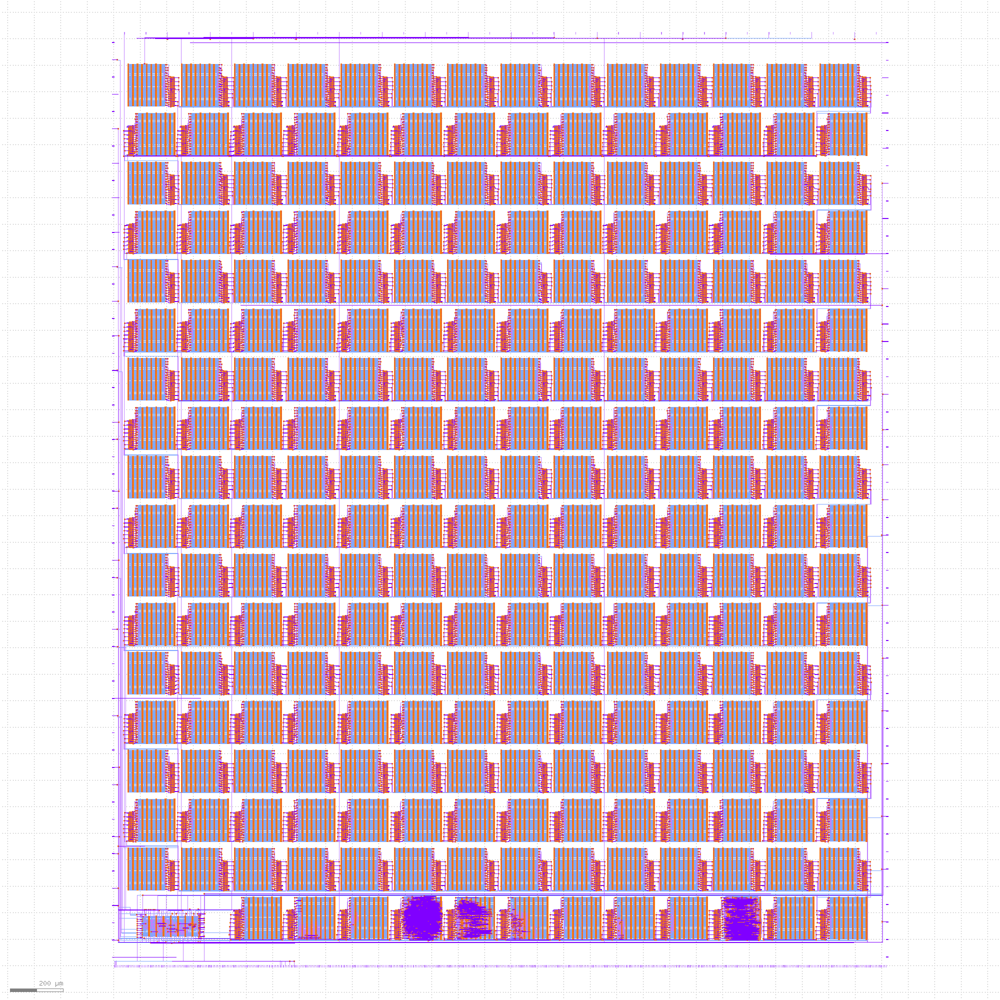

# TinyTapeout 03

* Visit https://tinytapeout.com for more information on the project and how to get involved.
* Read [INFO](INFO.md) for how the project is built and technical project notes.
* Read [Verification](VERIFICATION.md) for how we verify the project.

# Datasheet

[PDF Download](datasheet.pdf).

For the most recent automatic build, click the tt_datasheet badge above, then download the PDF artifact.

# GDS layout of all projects

# Project Index

| Index | Author | Title | Type | Git Repo |
| ----- | ------ | ------| -----| ---------|
| 0 | Matt Venn | Test Inverter Project | [Wokwi](https://wokwi.com/projects/357464855584307201) | https://github.com/TinyTapeout/tt03-test-invert |
| 1 | Wallie Everest | Chiptune | HDL | https://github.com/WallieEverest/tt03 |
| 2 | icegoat9 | 7 Segment Life | [Wokwi](https://wokwi.com/projects/357752736742764545) | https://github.com/icegoat9/tinytapeout03-7seglife |
| 3 | Meinhard Kissich, EAS Group, Graz University of Technology | Another Piece of Pi | HDL | https://github.com/meiniKi/tt03-another-piece-of-pi |
| 4 | nqbit | Wormy | HDL | https://github.com/nqbit/wormy |
| 5 | Kolos Koblasz | Knight Rider Sensor Lights | HDL | https://github.com/KolosKoblasz/tt03-knight_rider |
| 6 | Dylan Garrett | Single digit latch | [Wokwi](https://wokwi.com/projects/358970514554149889) | https://github.com/dgarrett/tt03-num-latch |
| 7 | Yannick Reiß | 4x4 Memory | [Wokwi](https://wokwi.com/projects/357897381919942657) | https://github.com/yannickreiss/TT3_Memory |
| 8 | Yannick Reiß | KS-Signal | [Wokwi](https://wokwi.com/projects/357106633951414273) | https://github.com/yannickreiss/TT3_KS-Signal |
| 9 | Mike Bell | Hovalaag CPU | HDL | https://github.com/MichaelBell/tt03-hovalaag |
