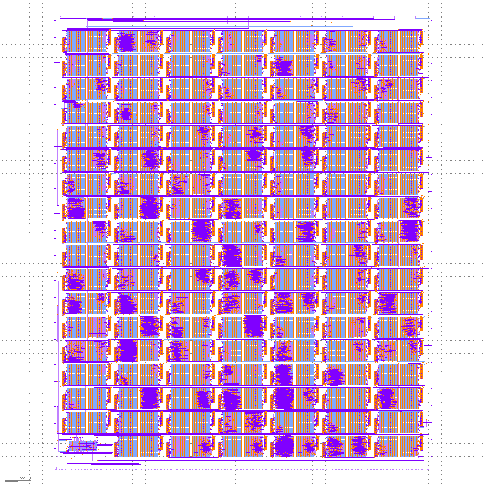

# TinyTapeout 03

* Visit https://tinytapeout.com for more information on the project and how to get involved.
* Read [INFO](INFO.md) for how the project is built and technical project notes.
* Read [Verification](VERIFICATION.md) for how we verify the project.

# Datasheet

[PDF Download](datasheet.pdf).

For the most recent automatic build, click the tt_datasheet badge above, then download the PDF artifact.

# GDS layout of all projects

# Project Index

| Index | Author | Title | Type | Git Repo |
| ----- | ------ | ------| -----| ---------|
| 0 | Matt Venn | Test Inverter Project | [Wokwi](https://wokwi.com/projects/357464855584307201) | https://github.com/TinyTapeout/tt03-test-invert |
| 1 | Wallie Everest | Chiptune | HDL | https://github.com/WallieEverest/tt03 |
| 2 | icegoat9 | 7 Segment Life | [Wokwi](https://wokwi.com/projects/357752736742764545) | https://github.com/icegoat9/tinytapeout03-7seglife |
| 3 | Meinhard Kissich, EAS Group, Graz University of Technology | Another Piece of Pi | HDL | https://github.com/meiniKi/tt03-another-piece-of-pi |
| 4 | nqbit | Wormy | HDL | https://github.com/nqbit/wormy |
| 5 | Kolos Koblasz | Knight Rider Sensor Lights | HDL | https://github.com/KolosKoblasz/tt03-knight_rider |
| 6 | Dylan Garrett | Single digit latch | [Wokwi](https://wokwi.com/projects/358970514554149889) | https://github.com/dgarrett/tt03-num-latch |
| 7 | Yannick Reiß | 4x4 Memory | [Wokwi](https://wokwi.com/projects/357897381919942657) | https://github.com/yannickreiss/TT3_Memory |
| 8 | Yannick Reiß | KS-Signal | [Wokwi](https://wokwi.com/projects/357106633951414273) | https://github.com/yannickreiss/TT3_KS-Signal |
| 9 | Mike Bell | Hovalaag CPU | HDL | https://github.com/MichaelBell/tt03-hovalaag |
| 10 | Niklas Fassbender | SKINNY SBOX | [Wokwi](https://wokwi.com/projects/359353377078748161) | https://github.com/nikals99/tt03-skinny-sbox |
| 11 | Tim Henkes | Stateful Lock | [Wokwi](https://wokwi.com/projects/359357227471086593) | https://github.com/Syndace/tt03-stateful-lock |
| 12 | Fabio Campos | Ascon's 5-bit S-box | [Wokwi](https://wokwi.com/projects/359360834113498113) | https://github.com/sopmacF/tt03-ascon-sbox |
| 13 | Alexander Schönborn | 8bit configurable galois lfsr | HDL | https://github.com/gr33nstyle/tt03-verilog-lfsr |
| 14 | Thorsten Knoll | Sbox SKINNY 8 Bit | [Wokwi](https://wokwi.com/projects/359372419264319489) | https://github.com/ThorKn/tt03_sbox_8bit_skinny |
| 15 | Marcus Michaely | BinaryDoorLock | [Wokwi](https://wokwi.com/projects/357178660283991041) | https://github.com/marcusmichaely/tt03-submission-template |
| 16 | shadow1229 | bad apple | HDL | https://github.com/shadow1229/tt03-bad-apple |
| 18 | Carin Schreiner | 4bit Adder | [Wokwi](https://wokwi.com/projects/354091612057990145) | https://github.com/SchreinerCarin/tt03-4bit-adder |
| 19 | Paul Campnell | 12-bit PDP8 | HDL | https://github.com/MoonbaseOtago/tt03-pdp8 |
| 20 | Carin Schreiner | CTF - Catch the fish | [Wokwi](https://wokwi.com/projects/360014965627378689) | https://github.com/SchreinerCarin/tt03-ctf |
| 21 | Yannick Reiß | Dot operation calculator | HDL | https://github.com/yannickreiss/TT3_dot_op |
| 22 | Emilian Miron | RiscV Scan Chain based CPU -- block 1 -- clocking | HDL | https://github.com/diferential/sc-rv-tt03-block1 |
| 23 | Emilian Miron | RiscV Scan Chain based CPU -- block 2 -- instructions | HDL | https://github.com/diferential/sc-rv-tt03-block2 |
| 24 | Emilian Miron | RiscV Scan Chain based CPU -- block 3 -- registers | HDL | https://github.com/diferential/sc-rv-tt03-block3 |
| 25 | Emilian Miron | RiscV Scan Chain based CPU -- block 4 -- ALU | HDL | https://github.com/diferential/sc-rv-tt03-block4 |
| 26 | Aidan McNay | 31b-PrimeDetector | HDL | https://github.com/Aidan-McNay/31b-PrimeDetection |
| 27 | Luke Vassallo | XOR Stream Cipher | HDL | https://github.com/LukeVassallo/tt03-xor-cipher |
